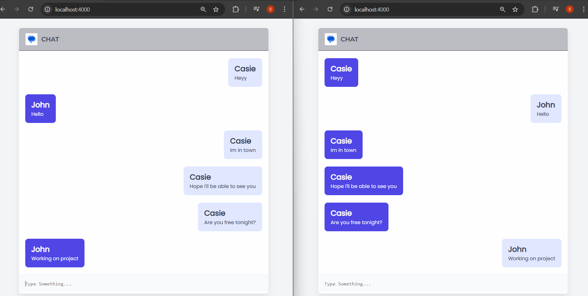

# 💬 Realtime Chat App

A simple realtime chat application using **Node.js**, **Express**, and **Socket.io**.

## Features

- Prompt-based username entry
- Realtime message exchange between clients
- Auto-scrolling chat interface
- Built with plain HTML, CSS, and JavaScript

## Installation

```bash
git clone https://github.com/your-username/chatbot.git
cd chatbot
npm install
node server.js
```

Then open http://localhost:4000 in your browser.

🧪 Usage
Open the app in two browser tabs

Enter different usernames when prompted

Start chatting in realtime!

javascript
Copy
Edit

Save the file.

## Screenshots



